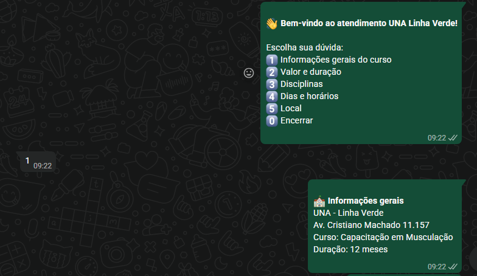
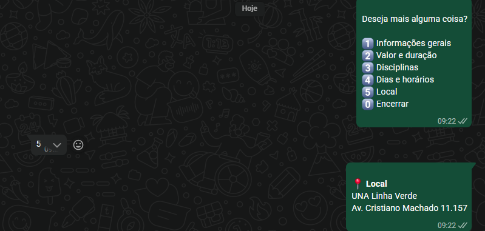
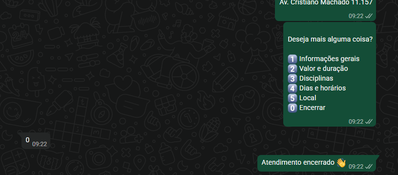
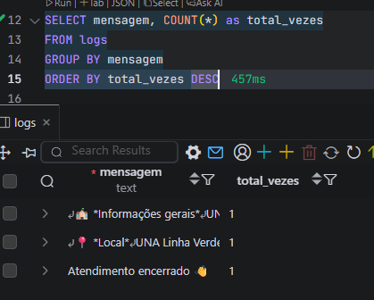

# ChatBot WhatsApp UNA Linha Verde


## Sumário
- [Recursos](#recursos)
- [Pré-requisitos](#pré-requisitos)
- [Instalação](#instalação)
- [Banco de Dados](#banco-de-dados)
- [Executando](#executando)
- [Uso](#uso)
- [API](#api)
- [Estrutura](#estrutura)
- [Conceitos Importantes](#conceitos-importantes)
- [Troubleshooting](#troubleshooting)
- [Observações Legais](#observações-legais)
- [Licença](#licença)
- [Capturas de Tela](#capturas-de-tela)


Um bot de atendimento via WhatsApp com painel web, usando Baileys (WhatsApp Web API), Node.js e MySQL. O projeto oferece um fluxo de perguntas frequentes, registra interações no banco e expõe um painel para monitorar o status do bot em tempo real.

## Recursos

- Autenticação do WhatsApp via QR Code
- Reconexão automática (exceto logout)
- Comandos de atendimento:
  - `!iniciar` mostra o menu principal
  - `1–5` respondem dúvidas frequentes
  - `0` encerra o atendimento
- Persistência em MySQL (`usuarios`, `perguntas`, `logs`)
- Painel web com:
  - Status Online/Offline
  - Última mensagem recebida
  - Ranking de perguntas mais comuns
- Endpoints HTTP:
  - `/` painel web
  - `/status` dados do painel em JSON
  - `/qr` visualização do QR em HTML
  - `/qr.png` imagem do QR (PNG)

## Pré-requisitos

- Node.js 18+
- MySQL 8+ (ou compatível)
- WhatsApp no celular para escanear o QR

## Instalação

```bash
npm i @whiskeysockets/baileys mysql2 pino qrcode qrcode-terminal
```


## Banco de Dados

Crie as tabelas básicas (ajuste tipos conforme sua necessidade):

```sql
CREATE TABLE IF NOT EXISTS usuarios (
  usuario_id VARCHAR(255) PRIMARY KEY,
  total_atendimentos INT NOT NULL DEFAULT 0
);

CREATE TABLE IF NOT EXISTS perguntas (
  id INT AUTO_INCREMENT PRIMARY KEY,
  usuario_id VARCHAR(255),
  pergunta VARCHAR(255),
  vezes INT NOT NULL DEFAULT 1,
  created_at TIMESTAMP DEFAULT CURRENT_TIMESTAMP
);

CREATE TABLE IF NOT EXISTS logs (
  id INT AUTO_INCREMENT PRIMARY KEY,
  usuario_id VARCHAR(255),
  mensagem TEXT,
  created_at TIMESTAMP DEFAULT CURRENT_TIMESTAMP
);
```

## Executando

```bash
node index.js
```

- O terminal exibirá o QR em ASCII e um link para `http://localhost:3000/qr`.
- Abra `http://localhost:3000/` para o painel.
- Escaneie o QR com o WhatsApp para autenticar.
> Dica: Se o QR ASCII estiver difícil de ler, use a página `/qr` ou a imagem `/qr.png`.

## Uso

- Envie `!iniciar` para receber o menu.
- Envie `1–5` para as seções de informação.
- Envie `0` para encerrar.

## API

- `GET /status`
  - Retorna `{ online, ultimaMsg, ranking }`
  - `ranking`: `[{ pergunta, quantidade }]`, proveniente de `perguntas` somadas por `vezes`

- `GET /qr`
  - Página HTML que exibe o QR como imagem e atualiza a cada 3s

- `GET /qr.png`
  - Imagem PNG do QR atual (quando disponível)

## Estrutura

```
.
├─ index.js        # Bot WhatsApp + servidor HTTP
├─ db.js           # Pool MySQL e validação de env
├─ public.html     # Painel web
├─ .env            # Configurações do MySQL/porta
└─ README.md       # Este arquivo
```

## Conceitos Importantes

- Estado do bot:
  - `isOnline` e `ultimaMsg` são atualizados via `connection.update` e `messages.upsert` (ver `index.js`).
- Reconexão:
  - Se a conexão fechar e não for `DisconnectReason.loggedOut`, reiniciamos `startBot()` (`index.js`).
- QR Code:
  - Renderizado no terminal com `qrcode-terminal` e disponível em `/qr` e `/qr.png` via pacote `qrcode`.
- Persistência:
  - As interações são salvas em `perguntas` e `logs`. Usuários têm contador em `usuarios`.

## Troubleshooting

- QR no terminal difícil de ler:
  - Use `http://localhost:3000/qr` para ver a imagem do QR.
- Bot fica Offline:
  - Verifique a internet, cookies de sessão em `./auth` e se não houve logout.
- Erros de MySQL:
  - Confirme variáveis do `.env` e se as tabelas existem.

## Observações Legais

- Automação de WhatsApp deve seguir os termos do WhatsApp. Use somente para fins permitidos pelo serviço e respeite privacidade dos usuários.

## Licença

MIT

## Capturas de Tela

### Funcionamento do Bot




### Dados / Painel



